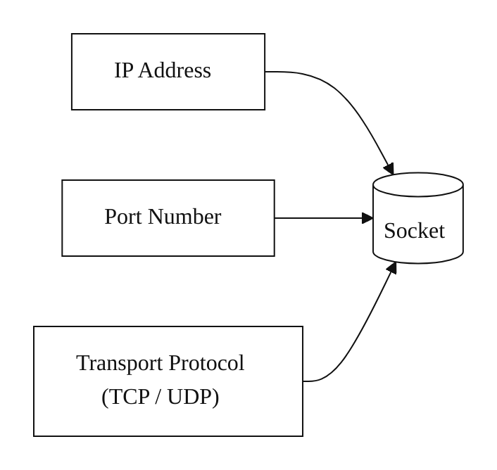
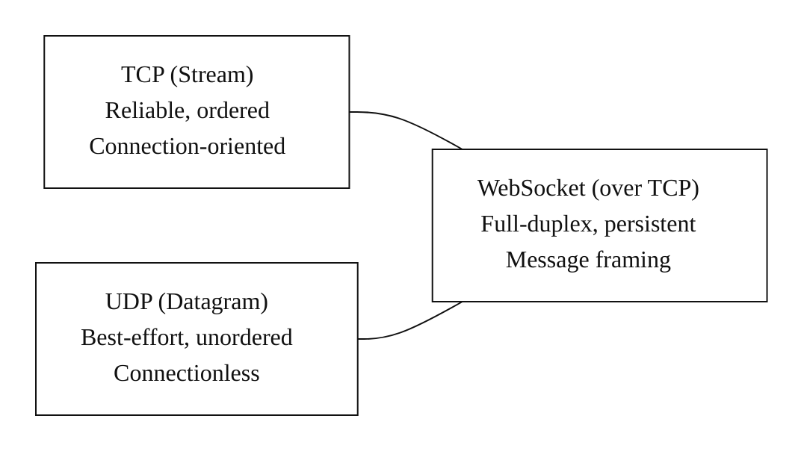
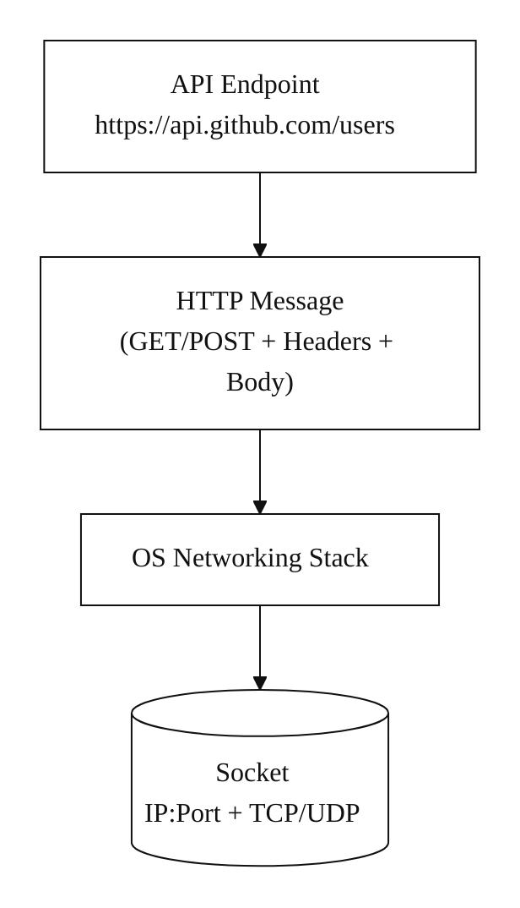
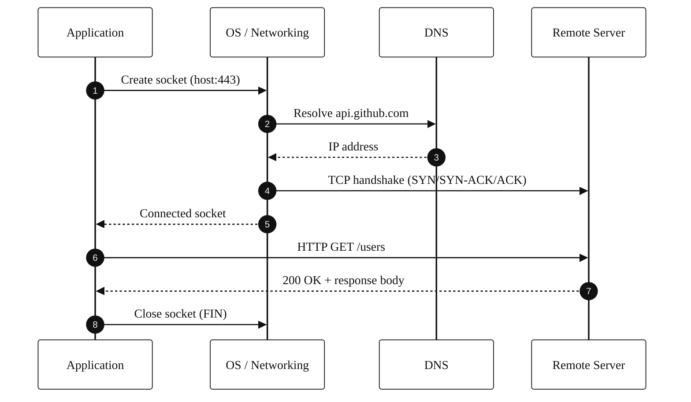
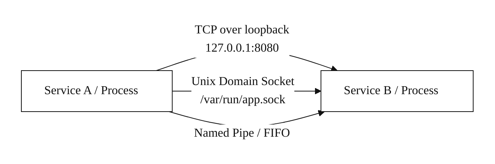

# Sockets

A socket's identity is defined by three main pieces of information:
- **IP address:** The unique address that identifies a specific device on a network.
- **Port number:** The number that identifies a specific application or process on that device.
- **Transport protocol:** The rules for transferring data, most commonly either the Transmission Control Protocol (TCP) or User Datagram Protocol (UDP).

Sockets behave differently based on the transport protocol they use: 
- **TCP sockets (stream sockets):** These provide a reliable, connection-oriented service. TCP ensures that data is delivered in the correct order and that packets are re-sent if they are lost. This is used for applications like web browsing, email, and file transfers.
- **UDP sockets (datagram sockets):** These offer a faster, connectionless service that does not guarantee data delivery or order. This is useful for applications where speed is more important than reliability, such as online gaming and live video streaming.
- **WebSockets:** An advanced type of socket that provides a persistent, full-duplex communication channel over a single TCP connection. This allows for real-time, interactive communication between a client and a server. 

**API Endpoint vs. Socket**

In order to use an API endpoint (the high-level logical address), the underlying system must interact via a socket (the low-level communication channel).
- An API endpoint is a high-level concept (like a phone book entry), while a socket is the low-level, network-level implementation of a communication channel (the active phone call).
- **API Endpoint:** A URL that identifies a specific resource or function within an API, like `https://api.github.com/users`. It abstracts away network details, allowing developers to focus on the data and function they want.
- **Socket:** A low-level software construct bound to a specific IP address and port number. It represents the actual communication endpoint for sending and receiving raw network data. The operating system uses sockets to open connections, fulfilling higher-level API requests.

The socket is the fundamental mechanism that allows your computer to speak across a network.

The API endpoint is the specific resource or function your application is requesting. The interaction happens in this sequence:
1. **Application level:** Your program, through a library or framework, sends a request to the API endpoint, for example, `GET https://api.github.com/users`.
2. **Protocol level:** The application constructs an HTTP message based on this endpoint. (Q: even if the endpoint is another service on the same server?)
3. **Network level:** Your operating system performs a series of actions that include creating a socket, resolving the domain name `api.github.com` to an IP address, and initiating a TCP connection to the correct IP address and port (usually 443 for HTTPS) using that socket.

**Q: Does this also include on the same server? So different services on the same server are connected to each other via sockets?** 

Yes, services on the same server also use sockets to communicate with each other. A socket is a fundamental mechanism for inter-process communication (IPC). 
- **Across the network:** When services are on different machines, they use network sockets (e.g., TCP/IP) to communicate over a physical network.
- **On the same server:** When services are on the same machine, they can also use network sockets to communicate. In this case, the communication travels through a special virtual network interface called the **loopback interface**, with the IP address `127.0.0.1` or the hostname `localhost`. The data never leaves the machine.
- **Optimized communication:** For faster and more efficient communication between processes on the same machine, operating systems also provide **Unix domain sockets** or **named pipes**. These mechanisms bypass the network stack entirely, resulting in lower latency and overhead compared to network sockets. 

**HTTP requests on the same server**

**Q: even if the endpoint is another service on the same server?**

Yes, even if the endpoint is another service on the same server, the communication still typically follows the same protocol-level steps.
- A request to an API endpoint is still formatted as an HTTP message, regardless of whether it's local or remote.
- The requesting service will still send an HTTP request (`GET`, `POST`, etc.) to the local IP address or `localhost`, targeting the port where the other service is listening.
- The receiving service, listening on a socket, will read the HTTP message, process it, and send an HTTP response back over the socket. 

This approach is common in microservices architectures, where multiple services run on the same machine (often within containers) and communicate with each other via their public or internal API endpoints. The loopback interface makes this communication functionally identical to communicating over a network, just much faster.
